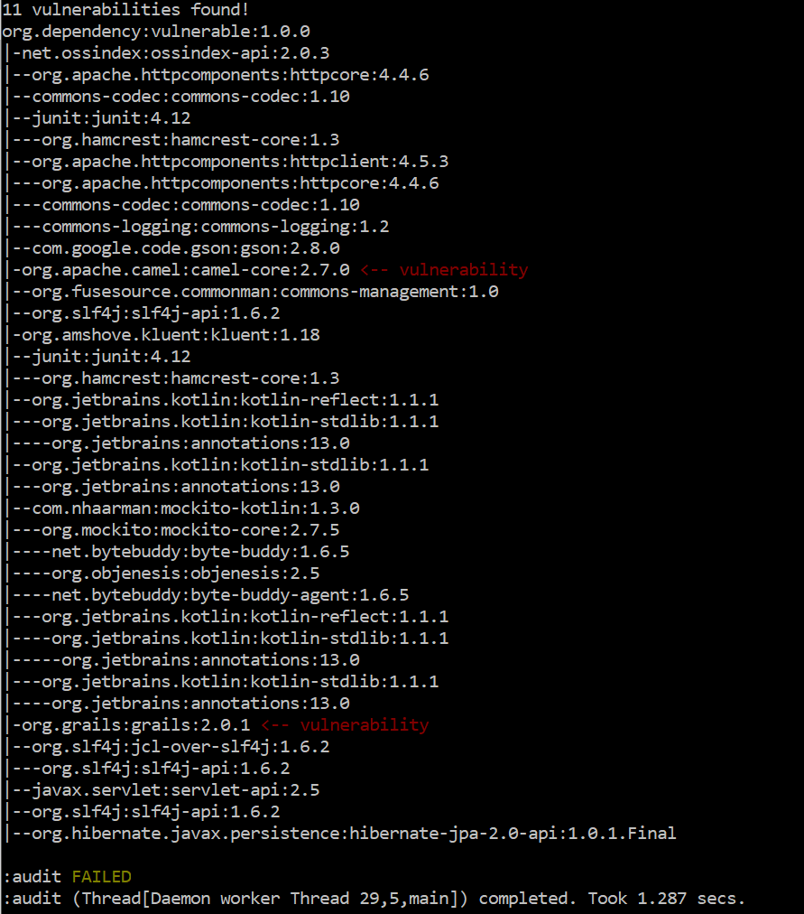

# ossindex-gradle-plugin
Audits a [gradle](https://gradle.org/) project using the [OSS Index REST API v2.0](https://ossindex.net) to identify known vulnerabilities in its dependencies.

Requirements
-------------

* Gradle
* An internet connection with access to https://ossindex.net 

Usage
-----

TODO (the plugin is yet to be released)

# Success output
This will run the OSS Index Auditor against the applicable maven project. A successful
scan finding no errors will look something like this:


# Failures

The following failure outputs are made with this gradle project:

```
buildscript {
    repositories {
        mavenLocal()
    }
    dependencies {
        classpath 'net.ossindex:ossindex-gradle-plugin:+'
    }
}

apply plugin: 'net.ossindex.audit'
apply plugin: 'java'

repositories {
    mavenLocal()
    mavenCentral()
    jcenter()
}

dependencies {
    // This dependency has transitive dependencies to 2 artifacts which contain vulnerabilities
    compile 'org.dependency:vulnerable:1.0.0'
}
```

### Error output
If a vulnerability is found that might impact your project, the output will resemble the
following, where the package and vulnerability details depends on what is identified.


### Dependency tree of vulnerabilities
If the `--info` flag is provided to gradle it will output a dependency tree which shows the transitive dependencies which have vulnerabilities.



Report output
-------------

TODO

Disable fail on error
------------------------

To let the build continue when vulnerabilities are found you can override the `failOnError` property:

```
audit {
    failOnError = false
}
```

Ignore vulnerability for package(s)
-----------------------------------

To ignore vulnerabilities from specific artifacts you can specify the artifacts on two ways:

Ignore a specific version:
```
audit {
    ignore = [ 'org.dependency:thelibrary:1.0.0' ]
}
```

Ignore a specific artifact (all versions):
```
audit {
    ignore = [ 'org.dependency:thelibrary' ]
}
```

`ignore` is a list which makes it possible to ignore multiple artifacts:

```
audit {
    ignore = [ 'org.dependency:thelibrary', 'net.awesomelibs:anotherlib:1.0.0' ]
}
```
